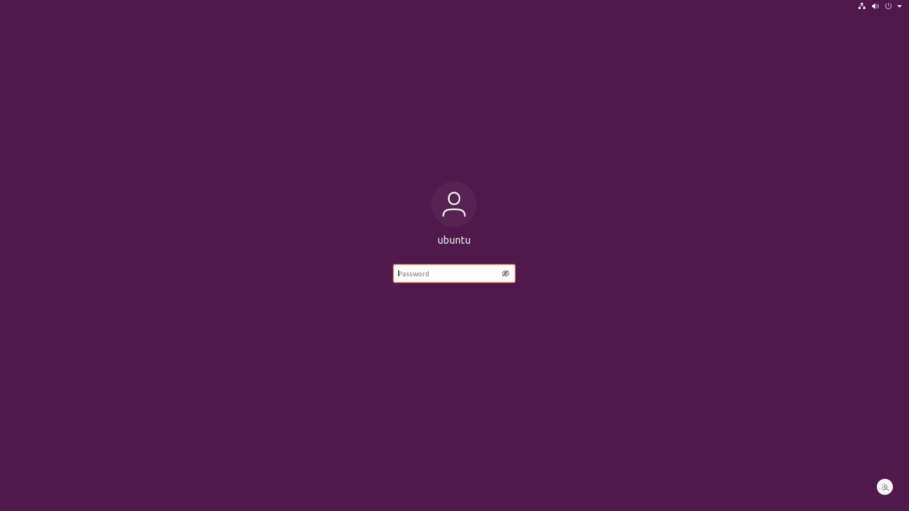
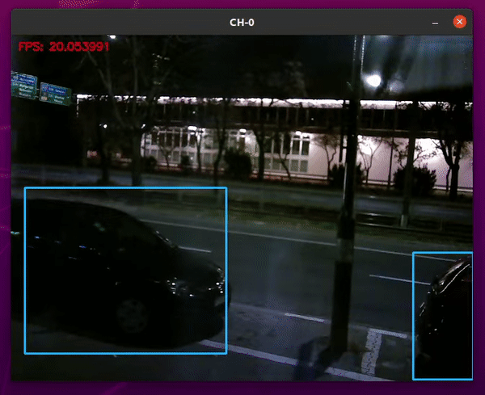
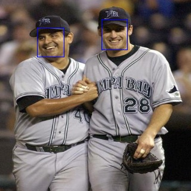
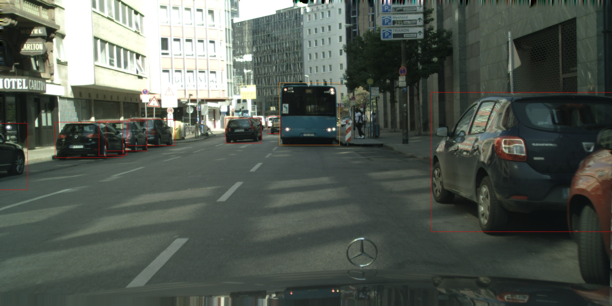
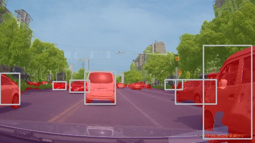

# Xilinx Kria KV260 tutorial

This repository was created to give an example of how to easily configure machine learning inference functions in the Xilinx KV260 Vision AI starter kit with Ubuntu.

It shows how Ubuntu 20 on Xilinx Kria KV260 Vision AI Starter Kit can be used to easily deploy accelerated machine learning applications.

## Requirements

 - Xilinx Kria KV260 Starter Kit with power supply,
 - MicroSD card,
 - USB webcam.

## Steps

Note: Most commands may require **sudo** privileges.

### Download Ubuntu image:

You can use link [here](https://ubuntu.com/download/amd-xilinx) or if you are using a Linux (recommended) you can simply run:

```bash
wget https://people.canonical.com/\~platform/images/xilinx/kria/iot-kria-classic-desktop-2004-x03-20211110-98.img.xz\?_ga\=2.241148739.1782650703.1667413054-511368486.1666550748 -o ubuntu_image.img.xz
```

### Flash Ubuntu image to MicroSD card:

On Windows you can use tool such as [BalenaEtcher](https://www.balena.io/etcher/).

If on Linux you can use `dd` command:

```bash
xzcat ubuntu_image.img.xz | dd of=/dev/mmcblkX bs=32M status=progress
```
NOTE: Replace `/dev/mmcblkX` with appropriate drive mapping for your system. Make sure the name specified in the `of` argument is the device enumeration, not the partition.

When SD card write process is complete you can eject your device.

### Set up the hardware:

To take full advantage of the tutorial's potential, it is recommended to connect the Starter Kit to a monitor, keyboard, mouse and Internet connection.
You also need to connect USB webcam.

This is described in the Xilinx tutorial - https://www.xilinx.com/products/som/kria/kv260-vision-starter-kit/kv260-getting-started-ubuntu/connecting-everything.html

### Boot the system:

The Xilinx getting started page describes how to boot Ubuntu on the KV260, and initialize the Ubuntu image with Xilinx utilities. Please follow the instructions at https://www.xilinx.com/products/som/kria/kv260-vision-starter-kit/kv260-getting-started-ubuntu/booting-your-starter-kit.html

Power ON the Starter Kit by connecting the power supply to the AC plug. The power LEDs should illuminate, and after about 10-15 seconds, you should see console output on the connected display.


After about a minute, the desktop login screen should appear.



The default login credentials are:<br>
**username**: ubuntu<br>
**password**: ubuntu<br>

NOTE: If you run this demo and are connected to the network on Poznan University of Technology, you need to set the correct time on the system. <br> To do this use the `date` command in the format:

```bash
date --set="YYYYMMDD HH:MM"
```

You also neet to install **xlnx-config** snap for system management:

```bash
snap install xlnx-config --classic --channel=1.x
```

Reboot your system.

```bash
reboot
```

Next you need to update the system:
```bash
apt update
xlnx-config.sysinit
```

Answer any questions from the installer in the affirmative.

### Install machine learning accelerator overlay:

The FPGA fabric of the KV260 can be dynamically loaded with user customizable hardware accelerators. A pre-built snap is available to install basic capabilities including the FPGA overlay. The overlay is the same one used in the NLP-SmartVision demo from the Kria App Store. This app features a B3136 DPU for accelerating machine learning inference applications. <br> You need to install **xlnx-nlp-smartvision** app for the overlay that it provides.

```bash
xlnx-config --snap --install xlnx-nlp-smartvision
```

Answer any questions from the installer in the affirmative.

In this tutorial we will also need **Vitis-AI** library snap. <br> You can download it by running:
```bash
snap install xlnx-vai-lib-samples
```

After installing **xlnx-vai-lib-samples** we are now set up.

### Load nlp-smartvision overlay:

To run Vitis-AI example we need to load the FPGA overlay that contains inference accelerator.

```bash
xlnx-config --xmutil unloadapp
xlnx-config --xmutil loadapp nlp-smartvision
```

### Person detection sample on live video

To run demo on live video, we need to determine the camera device enumeration using `v4l2-ctl`.

This command will list the video capture devices in the system:

```bash
v4l2-ctl --list-devices
```

Select USB webcam (`/dev/videoX`) device and pass it as an argument to test app.

```bash
xlnx-vai-lib-samples.test-video yolov2 yolov2_voc_pruned_0_71 /dev/videoX
```
You should see a window with the output from the camera output along with bounding boxes.



### Demos on dataset images

Vitis AI provides a test image archive that can be download to the target and used to run the tests. To download the sample image package, and extract them to the samples directory in your home directory, use the following commands:

```bash
wget https://www.xilinx.com/bin/public/openDownload?filename=vitis_ai_library_r1.3.1_images.tar.gz -O ~/vitis_ai_library_r1.3.1_images.tar.gz
tar -xzf vitis_ai_library_r1.3.1_images.tar.gz
cd samples
```

You can test multiple models and demos on this dataset. Few examples:

1. **Densebox**

```bash
xlnx-vai-lib-samples.test-jpeg facedetect densebox_320_320 facedetect/sample_facedetect.jpg
```

Original image                            |  Result image
:----------------------------------------:|:------------------------------------------:
  |  

2. **Yolov4**

```bash
xlnx-vai-lib-samples.test-jpeg yolov4 yolov4_leaky_spp_m yolov4/sample_yolov4.jpg
```

Original image                        |  Result image
:------------------------------------:|:-----------------------------------------:
  |  

3. **Platedetect**

```bash
xlnx-vai-lib-samples.test-jpeg platedetect plate_detect platedetect/sample_platedetect.jpg
```

Original image                             |  Result image
:-----------------------------------------:|:----------------------------------------------:
  |  

4. **Multitask**

```bash
xlnx-vai-lib-samples.test-jpeg multitask multi_task multitask/sample_multitask.jpg
```

Original image                           |  Result image
:---------------------------------------:|:--------------------------------------------:
  |  
## Author

- [@msierszulski](https://www.github.com/msierszulski)
